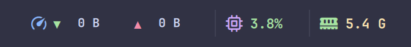
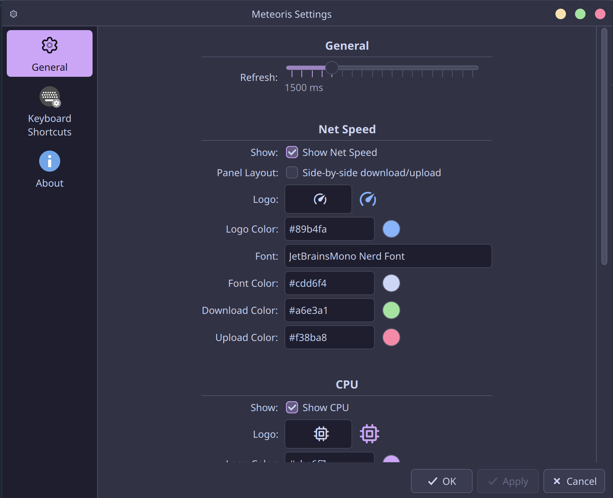
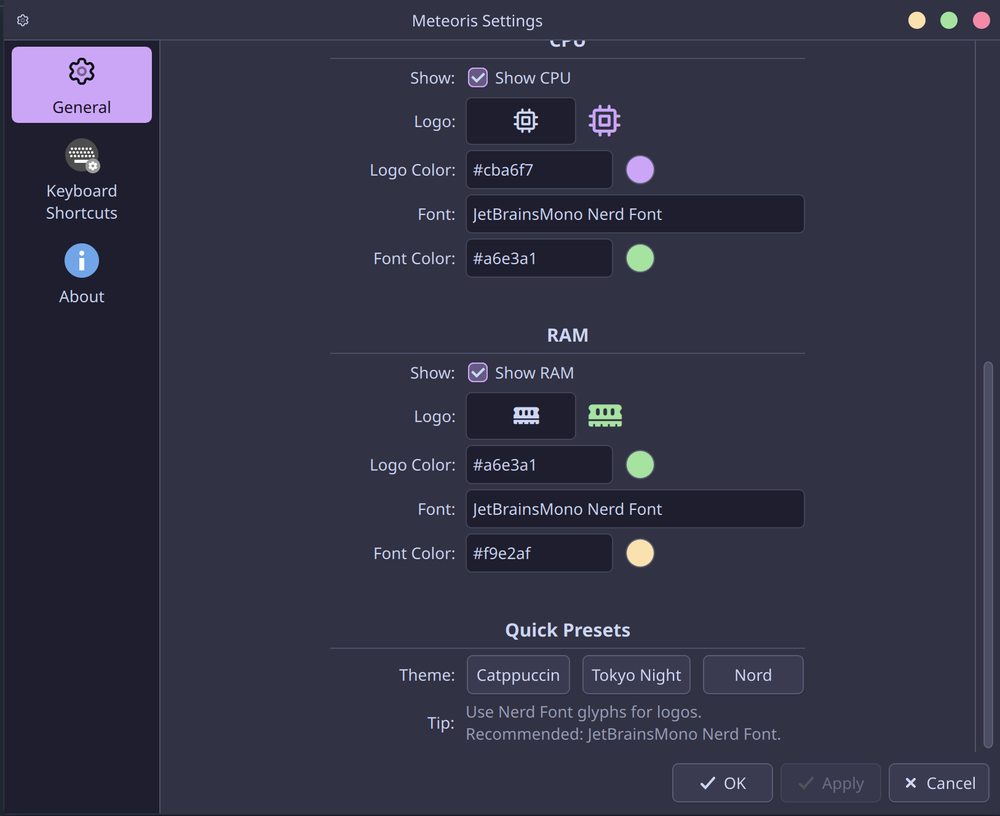

<div align="center">

# 🌌 Meteoris

A modern, lightweight system monitor widget for KDE Plasma 6.

Real-time CPU usage, memory usage, and network speed — designed to blend naturally into your desktop.

<p>
  
  
  
  
</p>



</div>

---

## About

Meteoris is a KDE Plasma widget focused on delivering essential system information in a clean and customizable format.

Instead of trying to be a full system monitor, it provides the information most users actually care about directly from the panel:

- Network speed
- CPU usage
- Memory usage

The goal is simple: stay informative, stay lightweight, and stay visually consistent with modern Plasma desktops.

---

## Features

### 🌐 Network Monitoring

Monitor real-time download and upload speeds directly from the panel.

- Compact mode
- Side-by-side layout
- Custom colors
- Custom icons

### 🧠 Memory Usage

View current RAM usage at a glance.

- Custom icon support
- Font customization
- Color customization

### ⚙️ CPU Usage

Live CPU usage monitoring with minimal overhead.

- Real-time updates
- Configurable appearance
- Consistent panel integration

### 🎨 Customization

Meteoris was built to be personalized.

Customize:

- Icons
- Colors
- Fonts
- Refresh interval
- Layout behavior
- Visibility of individual modules

---

## Screenshots

### Panel View

<p align="center">
  
</p>

### Settings

<p align="center">
  
</p>

### More Previews

<p align="center">
  
  
</p>

---

## Installation

### Quick Install

```bash
git clone https://github.com/SiyamX7/meteoris-kde-widget.git
cd meteoris-kde-widget

chmod +x install.sh
./install.sh
```

After installation:

**Desktop → Add Widgets → Meteoris**

---

## Manual Installation

```bash
mkdir -p ~/.local/share/plasma/plasmoids

cp -r . \
~/.local/share/plasma/plasmoids/SiyamX7.system.monitor.meteoris
```

Restart Plasma:

```bash
plasmashell --replace &
```

---

## Project Structure

```text
.
├── contents
│   ├── config
│   └── ui
├── install.sh
├── LICENSE
├── logos.conf
├── metadata.json
├── preview
└── README.md
```

---

## Compatibility

| Component | Supported |
|------------|------------|
| KDE Plasma 6 | ✅ |
| Qt 6 | ✅ |
| Wayland | ✅ |
| X11 | ✅ |

---

## Contributing

Suggestions, bug reports, and pull requests are always welcome.

If you find an issue or have an idea that could improve the widget, feel free to open an issue.

---

## License

Distributed under the MIT License.

See the LICENSE file for details.

---

<div align="center">

Made with ☕ and too much time spent tweaking KDE panels.

**SiyamX7**

</div>