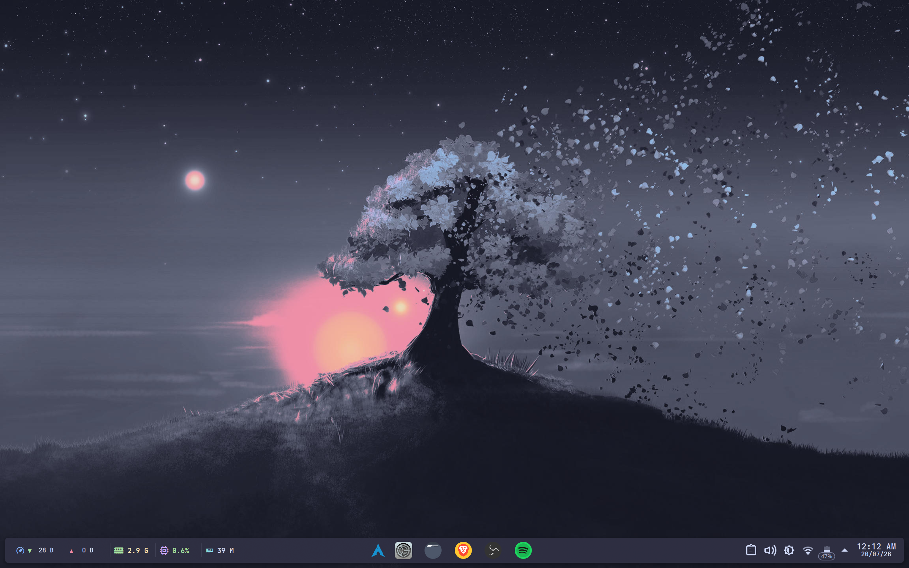
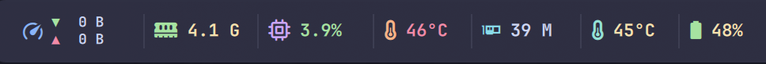
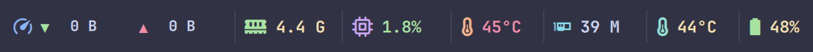
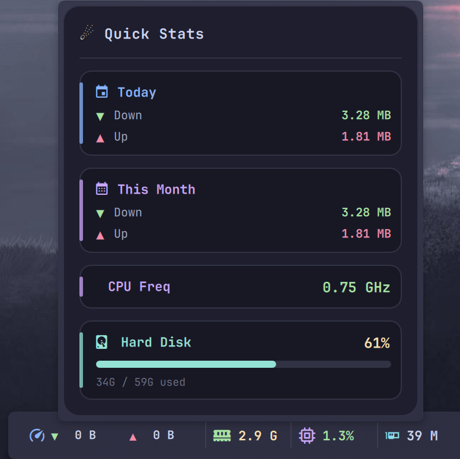
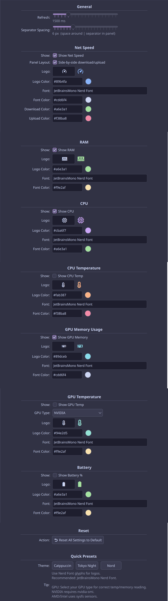

<div align="center">

# 🌌 Meteoris

### A modern, lightweight system monitor widget for KDE Plasma 6

Real-time network, CPU, RAM, temperatures, GPU & battery — wrapped in a
clean, fully customizable panel widget that blends naturally into your desktop.

<br>


<br>



<br>

<table align="center">
  <tr>
    <td align="center"><b>Stacked layout</b><br></td>
    <td align="center"><b>Inline layout</b><br></td>
  </tr>
</table>

</div>

<br>

<details open>
<summary align="center"><b>📑 Table of Contents</b></summary>
<br>

<div align="center">

[About](#-about) • [Features](#-features) • [Quick Stats Popup](#-quick-stats-popup) •
[Previews](#-previews) • [Customization](#-customization) • [Installation](#-installation) •
[Compatibility](#-compatibility) • [Contributing](#-contributing) • [License](#-license)

</div>
</details>

<br>

## 🪐 About

Meteoris is a KDE Plasma widget focused on delivering essential system
information in a clean and customizable format.

Instead of trying to be a heavy, full-blown system monitor, it surfaces the
information most users actually care about — **directly from the panel**, with
minimal overhead and zero external dependencies.

> Stay informative. Stay lightweight. Stay visually consistent.

Everything is read straight from the Linux kernel (`/proc`, `/sys`), so it works
out of the box on **any** distribution — no extra packages, no daemons.

<br>

## ✨ Features

<table>
<tr>
<td width="50%">

### 🌐 Network Speed
- Real-time download / upload
- Stacked **or** side-by-side layout
- Custom icon, font & colors

### 🧠 Memory Usage
- Live RAM usage at a glance
- Fully themeable icon & text

### ⚙️ CPU Usage
- Smooth live percentage
- Minimal polling overhead

### 🌡️ CPU Temperature
- Reads thermal zones directly
- Color-coded warnings

</td>
<td width="50%">

### 🎮 GPU Monitoring
- GPU **memory** usage
- GPU **temperature**
- Supports **NVIDIA / AMD / Intel**

### 🔋 Battery
- Percentage + status
- Auto-hides on desktops

### 🖱️ Hover Quick Stats
- Today / This-month traffic
- CPU frequency & disk usage
- **Persists across reboots**

### 🎨 Deep Customization
- Per-module visibility & order
- Icons, colors, fonts, spacing
- One-click theme presets

</td>
</tr>
</table>

<br>

## 🖱️ Quick Stats Popup

Hover over the panel widget to reveal a beautifully themed popup — no click
needed. It shows the deeper numbers you don't want cluttering the panel:

<div align="center">

</div>

- 📅 **Today** — total upload + download since midnight
- 🗓️ **This Month** — total upload + download this month
- ⚡ **CPU Frequency** — live average clock speed
- 💾 **Hard Disk** — usage with a progress bar

> Traffic totals are cached to `~/.cache/meteoris_traffic.conf`, so your
> daily / monthly counters **survive reboots and Plasma restarts**, and
> auto-reset on a new day / month.

<br>

## 🖼️ Previews

### Panel layouts

<table>
<tr>
<td align="center" width="50%"><sub><b>Stacked network</b></sub><br></td>
<td align="center" width="50%"><sub><b>Inline network</b></sub><br></td>
</tr>
</table>

### On the desktop


<br>

## 🎨 Customization

Every module is independently toggleable and themeable. Tweak icons, colors,
fonts, the refresh rate, the separator spacing, and the panel layout — or just
apply a preset and go.

<div align="center">

</div>

**Built-in theme presets:** `Catppuccin` · `Tokyo Night` · `Nord`

Plus a **Reset to Default** button to start fresh anytime.

<br>

## 📦 Installation

### ⚡ Quick install

```bash
git clone https://github.com/SiyamX7/meteoris-kde-widget.git
cd meteoris-kde-widget

chmod +x install.sh
./install.sh
```

Then: **Desktop → Add Widgets → Meteoris**

### 🛠️ Manual install

```bash
mkdir -p ~/.local/share/plasma/plasmoids

cp -r . \
  ~/.local/share/plasma/plasmoids/SiyamX7.system.monitor.meteoris
```

Restart Plasma:

```bash
plasmashell --replace &
```

<br>

## 🗂️ Project Structure

```text
.
├── contents
│   ├── config
│   │   ├── config.qml
│   │   └── main.xml
│   └── ui
│       ├── CompactRepresentation.qml
│       ├── ConfigGeneral.qml
│       ├── FullRepresentation.qml
│       └── main.qml
├── install.sh
├── LICENSE
├── logos.conf
├── metadata.json
├── preview
└── README.md
```

<br>

## 🧩 Compatibility

| Component | Supported | Note |
|-----------|:---------:|------|
| KDE Plasma 6 | ✅ | |
| Qt 6 | ✅ | |
| Wayland | ✅ | |
| X11 | ✅ | |
| Any Linux distro | ✅ | Net / CPU / RAM / Disk use kernel interfaces |
| NVIDIA GPU | ✅ | Requires `nvidia-smi` |
| AMD / Intel GPU | ✅ | Uses `sysfs` sensors |

<br>

## 🤝 Contributing

Suggestions, bug reports and pull requests are always welcome.

Found a bug or have an idea? [Open an issue](https://github.com/SiyamX7/meteoris-kde-widget/issues)
— or better, send a PR. 🚀

<br>

## ⭐ Star History

<div align="center">
<a href="https://star-history.com/#SiyamX7/meteoris-kde-widget&Date">
  
</a>
</div>

<br>

## 📜 License

Distributed under the **GPL-3.0** License. See the [LICENSE](LICENSE) file for details.

<br>

<div align="center">


<br>

Made with ☕ and too much time spent tweaking KDE panels.

**SiyamX7**

</div>